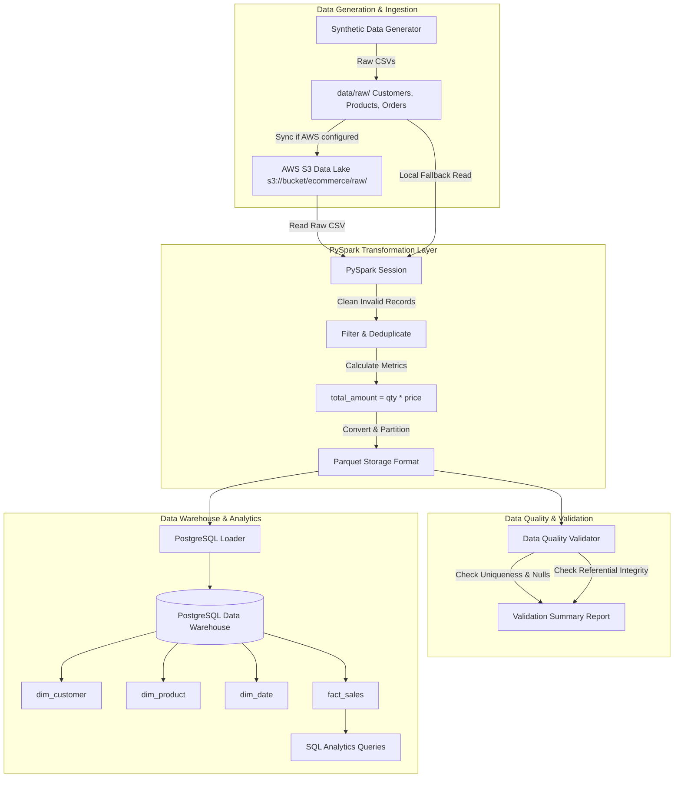

# 🛒 E-Commerce Data Engineering Pipeline

An end-to-end, production-style Data Engineering pipeline designed to process high-volume e-commerce transactions, enforce data quality, execute PySpark transformations, model a Star Schema Data Warehouse in PostgreSQL, and run business intelligence analytics.

---

## 📌 Project Overview & Business Case

Modern e-commerce platforms process thousands of transactions per second across customers, orders, and products. Processing raw, uncleaned transactional logs directly in operational databases slows down operational workflows and leads to inaccurate reporting due to duplicate entries, invalid quantities, and missing customer records.

This project solves this business problem by establishing an automated **ETL/ELT Data Pipeline**:
1. Ingesting multi-source raw CSV transaction files into an **AWS S3 Data Lake** (or local raw storage).
2. Leveraging **Apache Spark (PySpark)** for distributed data cleaning, deduplication, schema enforcement, and calculated metrics (`total_amount`).
3. Running an automated **Data Quality & Validation Engine** to filter invalid transactions and check referential integrity.
4. Structuring a high-performance **Star Schema Data Warehouse** in **PostgreSQL** for analytical reporting.
5. Implementing **Incremental Data Processing** to process daily order batches without re-running historical data.

---

## 🏗️ Pipeline Architecture



---

## 🛠️ Technology Stack

| Technology | Purpose | Why Chosen? |
| :--- | :--- | :--- |
| **Python 3.10+** | Core Pipeline Logic | Standard scripting language in Data Engineering; rich ecosystem of libraries. |
| **Apache Spark / PySpark** | Data Transformation Engine | Distributed memory processing framework. Ideal for large-scale data transformation. |
| **AWS S3** | Raw Data Lake Storage | Scalable, low-cost object storage with multi-tiered lifecycle support. |
| **Apache Parquet** | Processed Storage Format | Columnar, highly compressed, fast predicate pushdown querying. |
| **PostgreSQL** | Data Warehouse | Relational database ideal for structured Star Schema dimension modeling. |
| **SQL** | Analytics & Aggregations | Industry-standard query language for business intelligence. |
| **PyTest** | Automated Unit Testing | Verifies transformation correctness, deduplication logic, and validation rules. |
| **YAML / Python-Dotenv** | Configuration Management | Decouples credentials and environment paths from source code. |

---

## 📁 Project Structure

```
E-Commerce Data Engineering Pipeline/
├── config/
│   └── config.yaml              # Pipeline configuration (paths, db, quality rules)
├── data/                        # Git-ignored local data lake directory
│   ├── raw/
│   │   ├── customers/           # Raw customer CSVs
│   │   ├── products/            # Raw product catalog CSVs
│   │   └── orders/              # Daily partitioned order transaction CSVs (YYYY-MM-DD)
│   └── processed/               # Transformed Parquet output datasets
├── src/
│   ├── __init__.py
│   ├── utils/
│   │   ├── logger.py            # Centralized logging module
│   │   └── config_loader.py     # YAML & .env config loader
│   ├── ingestion/
│   │   ├── data_generator.py    # Synthetic raw data generator (clean & dirty test cases)
│   │   └── s3_ingestor.py       # AWS S3 uploader module (with local fallback)
│   ├── transformation/
│   │   └── spark_transformations.py # Core PySpark transformation functions
│   ├── validation/
│   │   └── data_validator.py    # Data Quality validation check engine
│   └── warehouse/
│       └── postgres_loader.py   # PostgreSQL Star Schema loader
├── pyspark/
│   ├── transform_customers.py   # Standalone Spark job for customer dimension
│   ├── transform_products.py    # Standalone Spark job for product dimension
│   └── transform_orders.py      # Standalone Spark job for orders fact table
├── sql/
│   ├── create_tables.sql        # DDL for Star Schema (Fact + Dimensions + Indexes)
│   ├── star_schema.sql          # Star Schema design documentation & views
│   └── analytics.sql            # Business analytics SQL queries
├── tests/
│   ├── conftest.py              # PyTest local SparkSession fixture
│   ├── test_data_generator.py   # Unit tests for data generation
│   ├── test_transformations.py  # Unit tests for PySpark calculations & cleaning
│   └── test_validation.py     # Unit tests for Data Quality rules
├── run_pipeline.py              # Main execution orchestrator CLI script
├── .env.example                 # Environment variable template
├── requirements.txt             # Project dependencies
├── .gitignore                   # Standard gitignore for python & spark
└── README.md                    # Project documentation & interview guide
```

---

## 📊 Datasets & Schema

The pipeline processes 3 core entities:

1. **Customers (`customers.csv`)**: `customer_id`, `name`, `email`, `city`, `country`, `signup_date`
2. **Products (`products.csv`)**: `product_id`, `product_name`, `category`, `price`
3. **Orders (`orders.csv`)**: `order_id`, `customer_id`, `product_id`, `order_date`, `quantity`, `price`, `order_status`

---

## 📐 Data Warehouse Model (Star Schema)

```
                 dim_customer
                 (customer_id [PK], name, email, city, country, signup_date)
                       |
                       | 1:N
dim_product ---- fact_sales ---- dim_date
(product_id [PK], (order_id [PK], customer_id [FK], (date_id [PK], full_date,
 product_name,   product_id [FK], date_id [FK],    day, month, quarter,
 category, price) order_date, quantity, unit_price, year, day_of_week)
                  total_amount, order_status)
```

---

## ⚡ Incremental Data Processing

Rather than re-processing the entire historical dataset on every execution (which scales linearly with cost and time), this pipeline supports **batch partition loading**:

- Raw orders are stored in daily folders:
  ```
  data/raw/orders/2026-09-01/orders.csv
  data/raw/orders/2026-09-02/orders.csv
  data/raw/orders/2026-09-03/orders.csv
  ```
- Running `python run_pipeline.py --batch-date 2026-09-02` processes **only** the `2026-09-02` batch partition and appends new records into the `fact_sales` Parquet dataset (`partitionBy("date_id")`).

---

## 🧪 Data Quality & Validation Layer

The pipeline includes an automated rule validator (`DataValidator`) that executes:
- **Primary Key Uniqueness Check**: Verifies zero duplicate keys in `customer_id`, `product_id`, `order_id`.
- **Non-Null Mandatory Check**: Ensures required columns (e.g. `customer_id`, `order_id`) contain no nulls or empty strings.
- **Numeric Bounds Check**: Validates `quantity > 0` and `total_amount >= 0`.
- **Referential Integrity Check**: Performs left-anti joins between `fact_sales` and `dim_customer`/`dim_product` to detect orphan foreign keys.

---

## 🚀 How to Run Locally Step-by-Step

### 1. Prerequisites
- Python 3.10+ installed
- PostgreSQL installed (or allow the pipeline to use local SQLite fallback mode)

### 2. Clone Repository & Install Dependencies
```bash
git clone https://github.com/your-username/ecommerce-data-engineering.git
cd ecommerce-data-engineering
pip install -r requirements.txt
```

### 3. Environment Configuration (Optional)
Copy `.env.example` to `.env` and fill in credentials:
```bash
cp .env.example .env
```

### 4. Run the Full End-to-End Pipeline
```bash
python run_pipeline.py --generate-data
```

### 5. Run Incremental Processing for a Single Date Batch
```bash
python run_pipeline.py --batch-date 2026-09-02
```

### 6. Run Automated Unit Tests
```bash
pytest tests/
```

---

## 📈 SQL Analytics & Sample Queries

Once loaded into the Data Warehouse, run queries from `sql/analytics.sql`:

### Query 1: Total Revenue & Average Order Value (AOV)
```sql
SELECT 
    COUNT(DISTINCT order_id) AS total_orders,
    SUM(quantity) AS total_units_sold,
    SUM(total_amount) AS total_revenue,
    ROUND(AVG(total_amount), 2) AS average_order_value
FROM fact_sales
WHERE order_status != 'Cancelled';
```

### Query 2: Top 5 Revenue-Generating Product Categories
```sql
SELECT 
    p.category,
    COUNT(f.order_id) AS total_orders,
    SUM(f.total_amount) AS category_revenue
FROM fact_sales f
JOIN dim_product p ON f.product_id = p.product_id
WHERE f.order_status != 'Cancelled'
GROUP BY p.category
ORDER BY category_revenue DESC
LIMIT 5;
```

---

## 💡 Key Interview Questions & Answers

Below is a comprehensive guide to answering interview questions about this project:

### 1. Why did you use PySpark instead of Pandas for data processing?
> **Answer:** Pandas processes data in-memory on a single machine CPU, limiting scalability to memory size (e.g. 16GB). PySpark is a distributed engine that can scale across a cluster of worker nodes, making it ideal for processing multi-gigabyte or terabyte-scale transaction logs in parallel.

### 2. Why store processed data in Parquet format instead of CSV?
> **Answer:** 
> 1. **Columnar Layout:** Parquet stores data by column rather than row, allowing queries to read only required columns (reducing IO).
> 2. **Compression:** Parquet uses Snappy/Gzip compression, reducing storage footprint by up to 75% compared to raw CSV.
> 3. **Schema Preservation:** Parquet retains explicit data types (integers, timestamps, doubles), eliminating string parsing errors common with CSV.
> 4. **Predicate Pushdown:** Query engines can read metadata statistics (min/max per rowgroup) to skip irrelevant data blocks.

### 3. What is the difference between a Data Lake and a Data Warehouse?
> **Answer:** 
> - **Data Lake (e.g. AWS S3):** Stores raw, unstructured, semi-structured, and structured data at low cost. Follows **ELT** (Extract, Load, Transform).
> - **Data Warehouse (e.g. PostgreSQL / Redshift):** Stores cleaned, highly structured, dimensionally modeled data optimized for fast SQL analytics and reporting. Follows **ETL** or **ELT**.

### 4. Why did you choose a Star Schema model over a normalized (3NF) model?
> **Answer:** 
> - **3NF (Third Normal Form)** minimizes data redundancy for transactional (OLTP) speed, but requires many complex `JOIN`s for analytical queries.
> - **Star Schema (OLAP)** denormalizes dimension tables around a central Fact table. This reduces join complexity, simplifies SQL query writing, and optimizes read performance for BI tools.

### 5. What is the difference between a Fact Table and a Dimension Table?
> **Answer:** 
> - **Fact Table (`fact_sales`):** Contains quantitative numerical measures (e.g. `quantity`, `unit_price`, `total_amount`) and Foreign Keys referencing dimensions. High row count, grows continuously.
> - **Dimension Table (`dim_customer`, `dim_product`, `dim_date`):** Contains descriptive context attributes (e.g. `customer_name`, `category`, `city`, `year`). Lower row count, referenced by fact table.

### 6. How does your pipeline handle duplicate or dirty incoming records?
> **Answer:** 
> In the PySpark transformation layer, we execute `.filter()` rules to drop records with null critical keys (`customer_id`, `product_id`) or non-positive quantities (`quantity <= 0`). We then invoke `.dropDuplicates(["order_id"])` to retain only the first valid record for each primary key. Additionally, the Data Quality layer executes left-anti joins to verify referential integrity before database ingestion.

### 7. How does Incremental Processing work in this pipeline?
> **Answer:** 
> Incoming order CSV files are partitioned in date directories (`data/raw/orders/YYYY-MM-DD/`). The pipeline accepts a `--batch-date` CLI parameter, reading and transforming only the new partition folder, and writing output in `append` mode partitioned by `date_id`. This avoids reading or reprocessing historical data.

### 8. What is Lazy Evaluation in Apache Spark?
> **Answer:** 
> Spark divides operations into **Transformations** (e.g., `filter()`, `select()`, `withColumn()`) and **Actions** (e.g., `count()`, `collect()`, `write`). Transformations do not execute immediately; instead, Spark builds a Directed Acyclic Graph (DAG). Computation is only triggered when an Action is called, allowing Spark's Catalyst Optimizer to optimize physical execution plans.

### 9. What is the difference between `repartition()` and `coalesce()` in Spark?
> **Answer:** 
> - `repartition(N)` increases or decreases the number of partitions by performing a full data shuffle across the cluster network.
> - `coalesce(N)` reduces the number of partitions by combining existing partitions locally without triggering a full network shuffle, making it much more efficient when reducing partition count after filtering.

### 10. How would you scale this pipeline to handle billions of records?
> **Answer:** 
> 1. **Deploy Spark on EMR or Databricks:** Auto-scale worker instances based on cluster memory utilization.
> 2. **Cloud Warehouse Migration:** Migrate PostgreSQL to Amazon Redshift or Snowflake for massively parallel processing (MPP).
> 3. **Orchestration:** Use Apache Airflow or Dagster to manage task DAGs, retries, and backfilling.
> 4. **Partition Pruning:** Ensure queries filter on `date_id` to read only relevant Parquet row groups.

---

## 🔮 Future Improvements

1. **Orchestration:** Add Apache Airflow DAGs for scheduled daily execution and failure alerting.
2. **CDC (Change Data Capture):** Implement Debezium / Kafka for real-time streaming ingestion into S3.
3. **Data Quality Framework:** Integrate Great Expectations or PyDeequ for enterprise quality profiling.
4. **CI/CD:** Add GitHub Actions workflow to run `pytest` and lint checks automatically on pull requests.

---

## 📜 License

Distributed under the MIT License. See `LICENSE` for more details.
